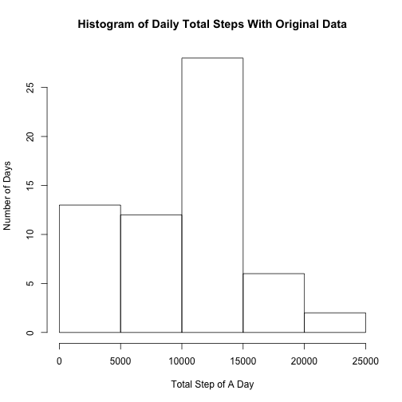
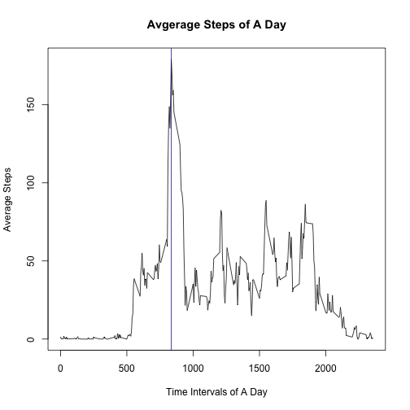
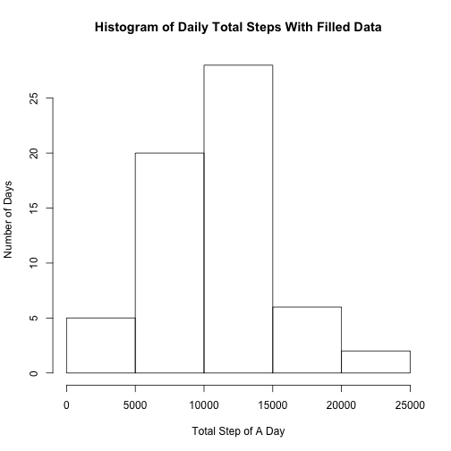
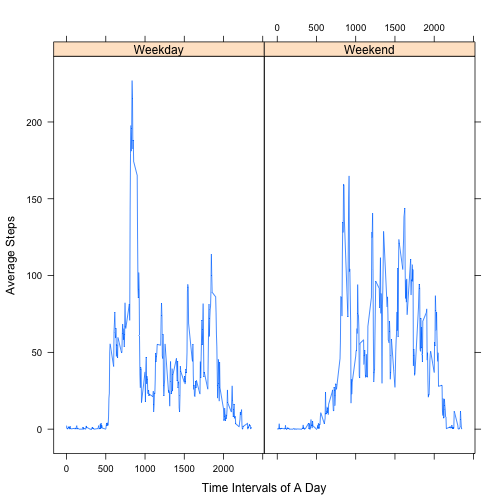

##Loading and preprocessing the data

```r
        processed <- read.csv("activity.csv") ## read data
        processed$date <- as.Date(processed$date) ## make date to date type
```
  
##What is mean total number of steps taken per day?
  

```r
        uniquedate <- unique(processed$date) ## list all the date
        n <- length(uniquedate) ## n is the total days
        countdailystep <- data.frame(matrix(nrow = n, ncol = 0))
        countdailystep$dailystep <-  vector(mode = "integer",length = n)
        countdailystep$date <- uniquedate ## initialize an empty data frame to store results
        
        for (i in 1:n){
                tempdata <- subset(processed, processed$date == uniquedate[i]) ## select the data of the same day
                countdailystep$dailystep[i] <- sum(tempdata$steps, na.rm = T)
        }
        countdailystep
```
  
We can plot the histogram of the total number of steps taken each day.
  

```r
hist(countdailystep$dailystep, main = "Histogram of Daily Total Steps With Original Data", xlab = "Total Step of A Day", ylab = "Number of Days")
```

 

```r
mean.1 <- ceiling(mean(countdailystep$dailystep))
median.1 <- median(countdailystep$dailystep)
```
  
Then we can get mean = 9355, and median = 10395.  

##What is the average daily activity pattern?  
First we need to calculate the mean of every interval

```r
        uniquedate <- unique(processed$date)
        n <- 288 ## n is the total number of intervals
        m <- length(uniquedate) ## total days
        stepofinterval <- data.frame(matrix(nrow = n, ncol = 0))
        stepofinterval$steps <-  vector(mode = "integer",length = n)
        stepofinterval$interval <- processed$interval[1:288]
        
        for (i in 1:n){
                tempstep <- 
                        subset(processed, processed$interval == stepofinterval$interval[i]) ## select the data of the same interval
                stepofinterval$steps[i] <- sum(tempstep$steps, na.rm = T)/m
        }
        stepofinterval
```
Then we can plot

```r
max.1 <- stepofinterval[which.max(stepofinterval$steps),]
plot(stepofinterval$interval,stepofinterval$steps, type = 'l', main = "Avgerage Steps of A Day", xlab="Time Intervals of A Day", ylab = "Average Steps")
abline(v = max.1$interval, col = "blue")
```

 
  
The maximum number of steps is 179.1, it happens in the interval 835  

##Imputing missing values  


```r
numofna <- sum(is.na(processed$steps)) ## count number of "NA"
```
The total number of missing values in the dataset is 2304.  
In order to fill the missing data, one easy thing we can do is to repalce the "NA" with the average number of steps in that interval. In paticular, with use the command ` ceiling()` to get the integer steps.

```r
        stepofinterval$steps <- ceiling(stepofinterval$steps)
        onlyna <- processed[is.na(processed),] ## select the rows with NA
        nadate <- unique(onlyna$date) ##list all the Date with NA
        m <- length(nadate)
        processed.1 <- processed ## replicate the data
        for (i in 1:m){
                processed.1[processed.1$date == nadate[i],]$steps <- stepofinterval$steps ##insert the NA with average steps
        }
```
  
Plot the new histogram and compute new mean, new median

```r
        n <- length(uniquedate) ## n is the total days
        countdailystep.1 <- data.frame(matrix(nrow = n, ncol = 0))
        countdailystep.1$dailystep <-  vector(mode = "integer",length = n)
        countdailystep.1$date <- uniquedate ## initialize an empty data frame to store results
        
        for (i in 1:n){
                tempdata <- subset(processed.1, processed.1$date == uniquedate[i])
                countdailystep.1$dailystep[i] <- sum(tempdata$steps, na.rm = T)
        }
        hist(countdailystep.1$dailystep, main = "Histogram of Daily Total Steps With Filled Data", xlab = "Total Step of A Day", ylab = "Number of Days")
```

 

```r
        options(scipen=999) ##disable the scientific notation
        mean.2 <- ceiling(mean(countdailystep.1$dailystep))
        median.2 <- median(countdailystep.1$dailystep)
```
Our new mean is 10599 and new median is 10395.
As we see in the histogram, the impact is that the days with 0 steps is largely reduced. As the consequece, total daily number of steps will increase.  

##Are there differences in activity patterns between weekdays and weekends?  


```r
        processed.2 <- processed.1 ##replicate the data
        processed.2$weekday <- weekdays(processed.2$date)
        for (i in 1:nrow(processed.2)) {                                         
                if (processed.2$weekday[i] %in% c("Saturday","Sunday")) {             
                        processed.2$weekday[i]<-"Weekend"   ## find the rows of weekend                             
                }
                else{
                        processed.2$weekday[i]<-"Weekday"    ##find the rows of weekday                             
                }
        }
        processed.2$weekday <- factor(processed.2$weekday, labels = c("Weekday", "Weekend")) ##label it
```
  
We can see the levels like this  

```r
levels(processed.2$weekday)
```

```
## [1] "Weekday" "Weekend"
```
   
Next we do is to calculate average steps with weekend and weekday.

```r
        n <- 288
        weekdaydata <- processed.2[processed.2$weekday == "Weekday",] ##select the rows with weekday
        weekenddata <- processed.2[processed.2$weekday == "Weekend",]
        m.weekday <- length(unique(weekdaydata$date)) ##compute how many days are weekday
        m.weekend <- length(unique(weekenddata$date))
        stepofinterval.1 <- stepofinterval ##replicate the data
        stepofinterval.2 <- stepofinterval
        for (i in 1:n){
                tempstep <- subset(weekdaydata, weekdaydata$interval == stepofinterval.1$interval[i]) ## have a temp data store the weekday data of the same row
                stepofinterval.1$steps[i] <- sum(tempstep$steps, na.rm = T)/m.weekday
                stepofinterval.1$weekday[i] <- "Weekday" ## mark it as weekday
                tempstep <- subset(weekenddata, weekenddata$interval == stepofinterval.2$interval[i])
                stepofinterval.2$steps[i] <- sum(tempstep$steps, na.rm = T)/m.weekend
                stepofinterval.2$weekday[i] <- "Weekend"
        }
        stepofinterval.weekday <- rbind(stepofinterval.1,stepofinterval.2) ##combine the two dataframe into one
        stepofinterval.weekday$weekday <- factor(stepofinterval.weekday$weekday, labels = c("Weekday", "Weekend")) ##label it
```
  


```r
library(lattice) ##if you do not have a "latice" package, you should install it first
xyplot(stepofinterval.weekday$steps ~ stepofinterval.weekday$interval|stepofinterval.weekday$weekday, type = 'l', xlab="Time Intervals of A Day", ylab = "Average Steps")
```

 
